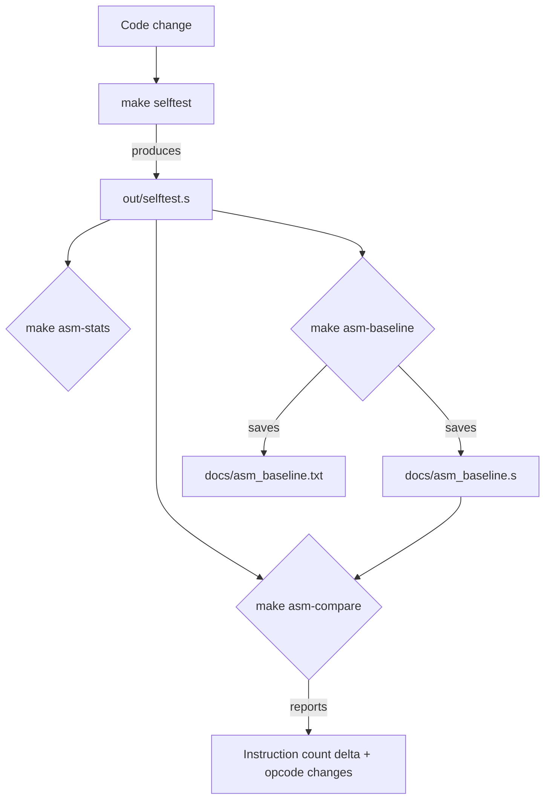

ASMBASE
Created: 2026-03-09 04:08

# Add Assembly Output Metrics Baseline for CODEGEN Measurement

[CODEGEN] Add Makefile targets that capture instruction counts and top instruction n-gram patterns from `out/selftest.s`, creating the measurement infrastructure needed for all future code generation optimization work.

## Goal Reference

[CODEGEN](../../goals/CODEGEN-output-code-quality.md): This plan directly addresses the CODEGEN potential plan: "Add rule-firing counters and a before/after instruction count comparison to the test infrastructure." It also enables the "Mine top instruction n-grams" potential plan by making n-gram analysis a one-command operation.

## Prior Plans

- **[PEEPFIX](../PEEPFIX-implement-failing-peephole-rules/spec.md)** (Status: PROPOSAL): Implements 2 failing peephole unit tests. PEEPFIX adds rules but has no way to measure their impact on real compiler output. ASMBASE provides the measurement that would quantify PEEPFIX's effect.
- **[PLAN2](../PLAN2-optimize-generated-code-size/spec.md)** (Status: PROPOSAL): Proposes code size testing infrastructure using a custom matcher on compiled functions. PLAN2's approach requires new test harness code and custom matchers. ASMBASE takes a different, simpler approach: use existing tools ([tools/asm_ngram.rb](../../tools/asm_ngram.rb), [tools/asm_diff_counts.rb](../../tools/asm_diff_counts.rb)) that are already proven, and measure the actual selftest output rather than synthetic test cases. ASMBASE captures real-world code quality across the entire selftest suite, while PLAN2 would only measure isolated micro-benchmarks.
- No archived plans target assembly metrics or instruction count tracking.

## Root Cause

The [CODEGEN](../../goals/CODEGEN-output-code-quality.md) goal has zero completed plans because there is no feedback loop for measuring code quality improvements. The compiler generates assembly in `out/selftest.s` during `make selftest`, but this output is never analyzed. Three analysis tools already exist in `tools/`:

- [tools/asm_ngram.rb](../../tools/asm_ngram.rb) (52 lines) — counts instruction n-gram frequencies, identifying redundant patterns
- [tools/asm_diff_counts.rb](../../tools/asm_diff_counts.rb) (40 lines) — compares opcode frequencies between two .s files, showing deltas
- [tools/compare_asm.rb](../../tools/compare_asm.rb) (47 lines) — finds first differing line between two .s files

These tools exist but are orphaned — no Makefile targets invoke them, no baseline data exists, and no workflow connects them to the development cycle. A developer implementing a peephole rule today has no easy way to answer "how many instructions did this eliminate?" or "what are the most common redundant patterns to target next?"

The root cause is **missing measurement infrastructure**: the tools exist but aren't integrated into the build workflow.

## Infrastructure Cost

Zero. This plan:
- Uses three existing tools in `tools/` (no new code beyond Makefile targets)
- Adds targets to the existing [Makefile](../../Makefile)
- Stores results in `docs/` (following existing pattern: `docs/rubyspec_*.txt`)
- Requires `out/selftest.s` which is already produced by `make selftest`
- Runs under MRI Ruby (no Docker needed for the analysis step itself; Docker only needed if `out/selftest.s` doesn't exist yet)

## Scope

**In scope:**

1. **Add `make asm-stats` Makefile target** that:
   - Counts total instructions in `out/selftest.s` (excluding comments, directives, labels)
   - Runs `tools/asm_ngram.rb out/selftest.s --n 3 --limit 30` to show top 30 instruction 3-grams
   - Runs `tools/asm_ngram.rb out/selftest.s --n 2 --limit 20` to show top 20 instruction 2-grams
   - Outputs results to stdout and saves to `docs/asm_baseline.txt`

2. **Add `make asm-compare` Makefile target** that:
   - Requires a previous baseline in `docs/asm_baseline.txt`
   - Generates current stats from `out/selftest.s`
   - Runs `tools/asm_diff_counts.rb` comparing saved baseline .s against current .s
   - Reports instruction count delta (positive = regression, negative = improvement)

3. **Capture initial baseline** by running `make asm-stats` after a successful `make selftest`, committing `docs/asm_baseline.txt`

4. **Document the top 5 most frequent 3-gram patterns** with brief annotations of what each pattern does and whether it's a peephole optimization candidate

**Out of scope:**
- Implementing new peephole rules based on the findings (that's follow-up work for PEEPFIX or new plans)
- Adding rule-firing counters to peephole.rb (that requires modifying the optimizer itself; this plan only measures output)
- CI integration or automated regression checks
- Modifying the peephole optimizer, compiler, or any non-Makefile source files

## Expected Payoff

**Immediate:**
- First-ever quantitative baseline for compiler output quality (total instruction count of selftest)
- Identification of the top redundant instruction patterns, prioritized by frequency
- One-command workflow for measuring peephole rule impact: `make selftest && make asm-compare`

**Downstream (CODEGEN):**
- Every future CODEGEN plan can include concrete "reduced N instructions" metrics in its results
- The top n-gram patterns become a prioritized TODO list for peephole rule development
- The baseline enables regression detection: if instruction count grows unexpectedly after a change, `make asm-compare` shows it
- Enables the CODEGEN potential plan "Mine top instruction n-grams from out/selftest.s using tools/asm_ngram.rb and implement rules for the top 3 patterns" — the mining step is now automated

**Documentation:**
- `docs/asm_baseline.txt` serves as a living record of code generation quality over time

## Proposed Approach

1. **Add Makefile targets** following the existing pattern (e.g., `rubyspec-*` targets):

   ```make
   .PHONY: asm-stats
   asm-stats:
   	@echo "=== Assembly Output Statistics for out/selftest.s ==="
   	@grep -c '^\s*[a-z]' out/selftest.s || true
   	@echo ""
   	ruby tools/asm_ngram.rb out/selftest.s --n 2 --limit 20
   	@echo ""
   	ruby tools/asm_ngram.rb out/selftest.s --n 3 --limit 30

   .PHONY: asm-baseline
   asm-baseline:
   	@echo "Capturing baseline from out/selftest.s..."
   	@cp out/selftest.s docs/asm_baseline.s
   	ruby tools/asm_ngram.rb out/selftest.s --n 3 --limit 30 > docs/asm_baseline.txt
   	ruby tools/asm_ngram.rb out/selftest.s --n 2 --limit 20 >> docs/asm_baseline.txt
   	@echo "Baseline saved to docs/asm_baseline.txt and docs/asm_baseline.s"

   .PHONY: asm-compare
   asm-compare:
   	ruby tools/asm_diff_counts.rb docs/asm_baseline.s out/selftest.s
   ```

2. **Run `make selftest` to ensure `out/selftest.s` exists**, then `make asm-baseline` to capture the initial baseline.

3. **Annotate the top 5 patterns** in `docs/asm_baseline.txt` with brief notes on what each pattern does and whether it represents a peephole optimization opportunity.



## Acceptance Criteria

- [ ] [Makefile](../../Makefile) contains `asm-stats` target that runs `tools/asm_ngram.rb` on `out/selftest.s` for both 2-gram and 3-gram analysis
- [ ] [Makefile](../../Makefile) contains `asm-baseline` target that saves `out/selftest.s` to `docs/asm_baseline.s` and n-gram output to `docs/asm_baseline.txt`
- [ ] [Makefile](../../Makefile) contains `asm-compare` target that runs `tools/asm_diff_counts.rb` comparing `docs/asm_baseline.s` against `out/selftest.s`
- [ ] `make asm-stats` executes successfully when `out/selftest.s` exists, showing instruction counts and top n-gram patterns
- [ ] `make asm-baseline` captures initial baseline data to `docs/asm_baseline.txt` and `docs/asm_baseline.s`
- [ ] `make asm-compare` executes successfully and reports instruction count delta between baseline and current output
- [ ] `docs/asm_baseline.txt` contains top 30 instruction 3-grams and top 20 instruction 2-grams, with the top 5 3-gram patterns annotated as optimization candidates or non-candidates
- [ ] `make selftest` and `make selftest-c` still pass (no regressions from Makefile changes)

---
*Status: PROPOSAL - Awaiting approval*
