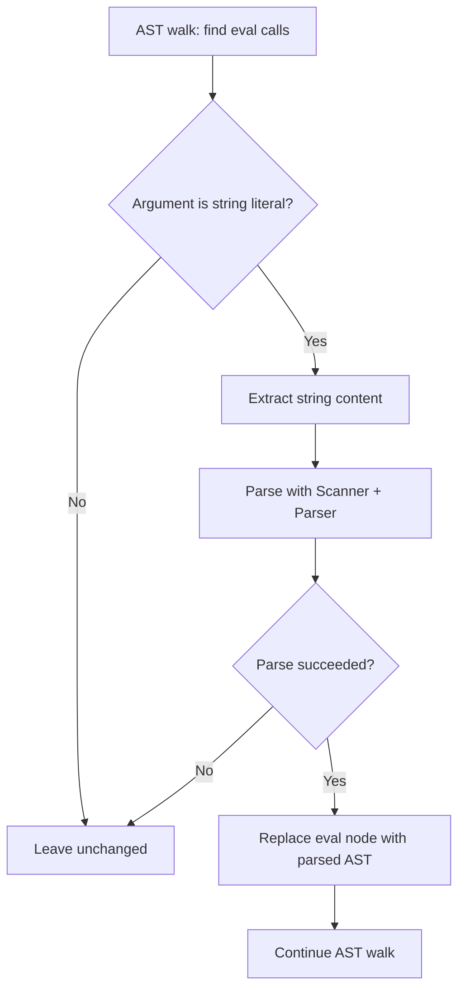

LITEVAL
Created: 2026-03-07

# Compile-Time eval() for String Literal Arguments

[COMPLANG] Transform `eval("literal string")` calls into inlined AST at compile time, enabling the AOT compiler to handle the most common eval pattern in Ruby test suites without runtime code generation.

## Goal Reference

[COMPLANG](../../goals/COMPLANG-compiler-advancement.md): Directly unblocks ~100 rubyspec test failures (per [TODO.md](../../TODO.md) line 70) that use `eval("...")` with string literals for testing language constructs.

Also advances [SELFHOST](../../goals/SELFHOST-clean-bootstrap.md): Removes the need for the stub `eval` in [lib/core/object.rb](../../lib/core/object.rb):207-210 for the literal case, bringing the compiler closer to handling standard Ruby idioms.

## Root Cause

The compiler is ahead-of-time (AOT) and cannot generate code at runtime. [lib/core/object.rb](../../lib/core/object.rb):207 defines `eval` as a stub that prints "eval not supported in AOT compiler" and returns `nil`. This causes every test that calls `eval("string literal")` to silently produce wrong results.

However, `eval` with a **string literal** argument is fully resolvable at compile time -- the string content is known statically and can be parsed by the existing parser during the transform phase. The parsed AST can then be inlined in place of the eval call, producing identical behavior to MRI's runtime eval for this common case.

This is the same principle behind existing transforms like `rewrite_strconst` and `rewrite_integer_constant` -- statically known values are resolved at compile time.

The rubyspec suite heavily uses `eval("...")` for testing:
- `eval("1 + 2")` -- arithmetic in eval context
- `eval("class Foo; end")` -- class definitions
- `eval("def foo; end")` -- method definitions
- `eval("x = 1; x")` -- variable scoping tests

[TODO.md](../../TODO.md) line 70 estimates ~100 test failures from missing eval support, describing the approach as: "Transform `eval("literal string")` to inline lambda at compile time."

## Infrastructure Cost

**Low**. This plan adds one new rewrite method to the existing transform pipeline in [transform.rb](../../transform.rb). It reuses the existing `Scanner` and `Parser` classes -- no new parsing infrastructure needed. No build system changes, no new files, no external dependencies.

The only integration point is adding a `rewrite_eval` call to the `preprocess` method in [transform.rb](../../transform.rb):1473-1497, following the established pattern of the 15+ existing rewrite methods.

## Prior Plans

No prior plans target eval functionality. Related references:
- [HEREDOCESC](../archived/HEREDOCESC-heredoc-escape-sequences/spec.md) (Status: IMPLEMENTED) noted that 2 of its remaining heredoc_spec failures require eval -- this plan would fix those.
- [CASEFIX](../archived/CASEFIX-fix-case-spec-crash/spec.md) (Status: REJECTED for wrong focus) mentioned eval as a possible crash trigger in case_spec -- this plan would eliminate that crash vector.
- [TODO.md](../../TODO.md) line 70-73 explicitly lists this as a Priority 2 feature with ~100 test failure impact.

## Scope

**In scope:**

1. **Add `rewrite_eval` transform method** to [transform.rb](../../transform.rb) that:
   - Walks the AST looking for `[:call, :eval, [arg]]` nodes where `arg` is a string literal (`:strconst` or `:concat` of string constants)
   - For each match, extracts the string content
   - Parses the string using `Scanner` and `Parser` (with `norequire: true`)
   - Replaces the eval call node with the parsed AST (wrapped in a `:do` block if multiple expressions)
   - On parse failure (malformed string), leaves the original eval call intact (graceful degradation)

2. **Handle `Binding#eval` and `instance_eval` with string literals** -- detect `[:callm, obj, :eval, [strconst]]` patterns for the same transformation where safe (at minimum, top-level `eval` and `TOPLEVEL_BINDING.eval`)

3. **Wire into preprocess pipeline** -- add `rewrite_eval(exp)` call in [transform.rb](../../transform.rb) `preprocess` method, positioned after `rewrite_strconst` (so string constants are already normalized) but before `rewrite_let_env` (so inlined variables get proper environment treatment)

4. **Validate**: `make selftest`, `make selftest-c`, `make spec` must pass. Run eval-heavy rubyspec files to measure impact.

**Out of scope:**
- Dynamic eval (`eval(variable)`) -- impossible in AOT without JIT
- `eval` with binding argument that changes variable scope (`eval("x", binding)`) -- complex scoping
- `class_eval`/`module_eval` with string arguments -- different semantics
- `instance_eval` with string arguments beyond simple cases

## Expected Payoff

- **~100 rubyspec test failures converted to passes** (per [TODO.md](../../TODO.md) estimate) across language/, core/, and other suites
- **2 heredoc_spec failures fixed** (noted in [HEREDOCESC](../archived/HEREDOCESC-heredoc-escape-sequences/spec.md))
- **Potential crash-to-pass conversions** for spec files where eval failure causes cascading issues
- **Zero regression risk** for non-eval code paths -- the transform only activates on eval calls with literal arguments
- **Graceful degradation** -- if the string can't be parsed, the original eval call remains (falls through to the existing stub)

## Proposed Approach

1. **Implement `rewrite_eval`**: Use `depth_first(:call)` to find eval calls. Check if the first argument is a `:strconst` node. If so, instantiate `Scanner.new(StringIO.new(string_content))` and `Parser.new(scanner, norequire: true)`, call `parse(false)` to get the AST without core library loading. Replace the `:call` node in-place with the parsed result.

2. **Handle multi-expression results**: `eval("a = 1; b = 2")` parses to `[:do, [:assign, :a, 1], [:assign, :b, 2]]`. The `:do` block naturally replaces the eval call node.

3. **Handle callm patterns**: Also match `[:callm, receiver, :eval, [strconst]]` for cases like `TOPLEVEL_BINDING.eval("code")` or `binding.eval("code")`.

4. **Error handling**: Wrap the parse attempt in a begin/rescue. If the string contains syntax that the parser can't handle (e.g., regex literals), leave the original eval call. Log a warning for debugging.

5. **Position in pipeline**: Insert after `rewrite_strconst` (string constants resolved) and before `rewrite_let_env` (variable environment analysis). This ensures inlined code gets full variable tracking.

## Acceptance Criteria

- [ ] `rewrite_eval` method exists in [transform.rb](../../transform.rb) and is called from `preprocess`
- [ ] `eval("1 + 2")` compiles and produces `3` at runtime (not `nil`)
- [ ] `eval("x = 1; x + 2")` compiles and produces `3` at runtime
- [ ] `eval(dynamic_variable)` still falls through to the stub (prints warning, returns nil) -- no regression
- [ ] Malformed eval strings (e.g., `eval("def")`) don't crash the compiler -- graceful fallback to stub
- [ ] `make selftest` passes with no regressions
- [ ] `make selftest-c` passes with no regressions
- [ ] `make spec` passes with no regressions
- [ ] At least 10 previously-failing rubyspec tests now pass due to eval support (validated by running eval-heavy spec files before and after)
- [ ] A spec file `spec/eval_literal_spec.rb` exists with mspec tests covering: simple expression eval, multi-statement eval, eval with local variables, eval defining a method, eval with unparseable string (graceful fallback)

## Open Questions

- Should `eval` with string interpolation be handled? E.g., `eval("#{method_name}")` -- the interpolation result is dynamic, but if all interpolated parts are string literals, it could be resolved. Likely out of scope for v1.
- The TODO.md mentions "inline lambda" as the wrapping mechanism. Is a lambda wrapper needed for proper scoping, or is direct AST inlining sufficient? Direct inlining should work because the inlined code executes in the same scope context as the eval call site.
- Should we track which eval calls were successfully transformed for diagnostic reporting?

---
*Status: PROPOSAL - Awaiting approval*
