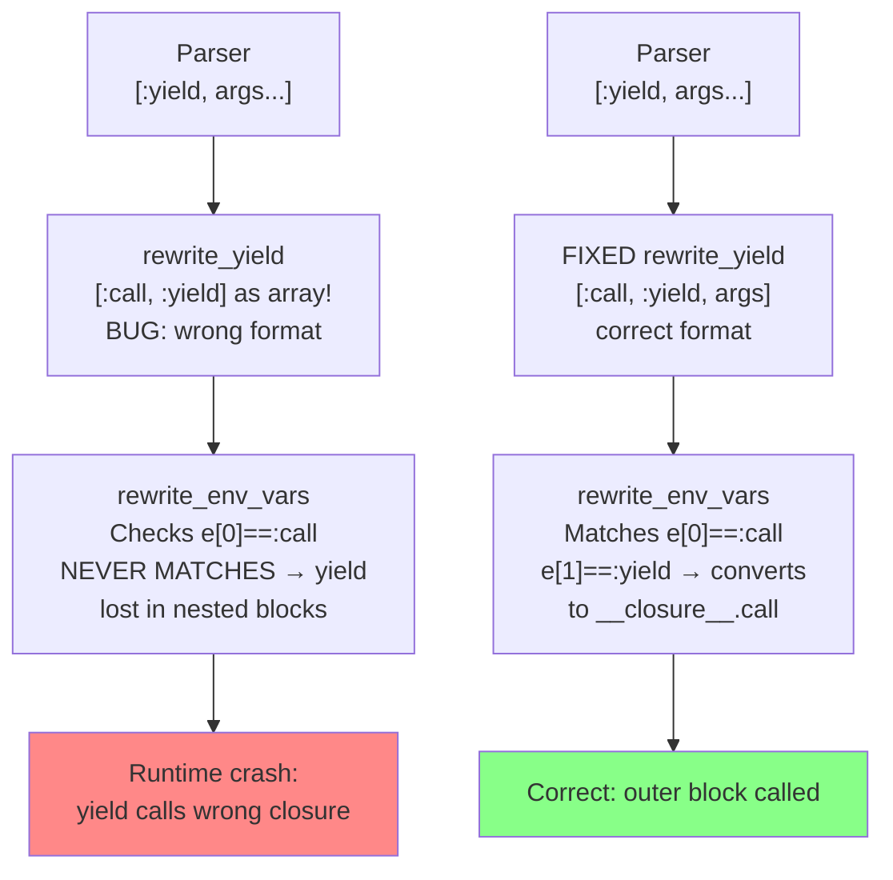

YIELDFIX
Created: 2026-02-28

# Fix Yield in Nested Block Contexts

[SELFHOST] Investigate and fix the runtime crash that occurs when a compiled program calls
`yield` inside a nested block (e.g., `[1].each do |x| yield x end`), removing 4 `@bug`
workarounds from `emitter.rb` and `globals.rb` and enabling `yield` to be used idiomatically
in compiler source code where `block.call(...)` is currently substituted.

## Goal Reference

[SELFHOST](../../goals/SELFHOST-clean-bootstrap.md)

Also advances [COMPLANG](../../goals/COMPLANG-compiler-advancement.md): fixing yield in nested
blocks unblocks a range of rubyspec tests that use iterators with blocks (e.g., `collect`,
`select`, `each_with_object` implementations written in pure Ruby).

## Prior Plans

- **[BUGAUDIT](../archived/BUGAUDIT-validate-bug-workarounds/spec.md)** (Status: IMPLEMENTED):
  Audited all 25 `@bug` markers, confirmed Cat 1 (yield in nested blocks, 5 markers) as
  reproducing with runtime crashes, and created `spec/bug_yield_in_nested_block_spec.rb`
  (all 5 tests crash). BUGAUDIT was diagnostic — it documented the bug but explicitly excluded
  fixing it. This plan targets the confirmed Cat 1 bugs with a specific fix.

No prior plan has ever attempted to fix this category.

## Root Cause

The compiler supports `yield` through a two-phase transform in [transform.rb](../../transform.rb):

**Phase 1** (`rewrite_yield`, line 1358): Converts `[:yield, args...]` AST nodes to
`[:call, :yield, args]` format.

**Phase 2** (`rewrite_env_vars`, lines 756–766, called from `rewrite_let_env`): When
processing a method's body for closure variable capture, converts `[:call, :yield, args]`
into `[:callm, :__closure__, :call, args]` — a call to the block passed into the method.

The mechanism for making this work across nested blocks is:
- Line 863: `__closure__` is always added to every method's closure environment (`env`)
- Line 880–884: The prologue assigns `__env__[N] = __closure__` to save the method's block
- Inside nested blocks, `__closure__` references are rewritten to `[:index, :__env__, N]`

The bug: **the two-phase expansion does not compose correctly in nested block scopes.**
Specifically, `rewrite_yield` converts `[:yield, args...]` to `[[:call, :yield], args...]`
(note: the first element becomes the *array* `[:call, :yield]`, not the symbol `:call`). The
Phase 2 check at line 759 tests `e[0] == :call && e[1] == :yield` — but after Phase 1, `e[0]`
is the array `[:call, :yield]`, not the symbol `:call`, so the check **never matches** inside
nested block bodies processed by `rewrite_env_vars`.

The consequence: `yield` inside a nested block body is never converted to
`__closure__.call(args)`. At runtime, the nested block has no valid way to call the outer
method's block, causing a crash (null dereference or wrong function call).

A secondary issue: `yield f[0], f[1]` (yield with multiple arguments including method calls)
may be parsed differently than expected, as documented in [globals.rb:46](../../globals.rb) with
the comment "gets turned into calling 'comma'". This variant is in scope for investigation.

## Infrastructure Cost

Low. The fix is confined to [transform.rb](../../transform.rb) (1748 lines), specifically the
`rewrite_yield` / `rewrite_env_vars` interaction (lines 697–804 and 1358–1362). No new files,
no build system changes, no external dependencies. Validation uses the existing spec file and
`make selftest` / `make selftest-c`.



## Scope

**In scope:**

1. **Fix `rewrite_yield`** ([transform.rb:1358–1362](../../transform.rb)): Change the
   rewrite so that `[:yield, args...]` produces `[:call, :yield, args]` (where `:call` is
   the first element, `:yield` is the second) — matching the format expected by
   `rewrite_env_vars` at line 759. Currently `e[0] = [:call, :yield]` produces an array at
   position 0; the fix should produce a flat `:call` node.

2. **Verify the env-capture chain for `__closure__`**: Confirm that after fixing Phase 1,
   the `rewrite_env_vars` logic at lines 756–766 correctly rewrites the `__closure__`
   reference in nested block bodies to `[:index, :__env__, N]`. If not, fix the rewrite
   logic.

3. **Investigate `yield f[0], f[1]` (globals.rb)**: Run `spec/bug_yield_in_nested_block_spec.rb`
   and determine whether the multi-argument yield crash is the same root cause or a separate
   parsing issue. Fix if it's the same; document separately if different.

4. **Remove the 4 `block.call` workarounds**:
   - [emitter.rb:393](../../emitter.rb) — `block.call(reg)` → `yield reg`
   - [emitter.rb:410](../../emitter.rb) — `block.call(c.reg)` → `yield c.reg`
   - [emitter.rb:419](../../emitter.rb) — `block.call(r)` → `yield r` (in `with_register_for`)
   - [globals.rb:46](../../globals.rb) — `block.call(f[0],f[1])` → `yield f[0],f[1]` (if
     multi-arg yield is also fixed)

5. **Update [compile_calls.rb:323](../../compile_calls.rb)** comment to reflect that yield
   in nested blocks now works correctly.

6. **Validate**: Run `make selftest` and `make selftest-c` to confirm no regressions.

**Out of scope:**

- Fixing `block_given?` in nested lambdas (Cat 4, a separate bug)
- Fixing break register corruption in regalloc (Cat 7)
- Fixing parser/MRI divergence (Cat 6)
- Adding new rubyspec targets (separate COMPLANG plan)

## Expected Payoff

**Direct (SELFHOST):**
- `spec/bug_yield_in_nested_block_spec.rb` passes (currently: all 5 tests crash)
- 4 `@bug` workarounds removed from compiler source (`emitter.rb` ×3, `globals.rb` ×1)
- Compiler source becomes more idiomatic Ruby; `yield` usable in nested iteration contexts

**Indirect (COMPLANG):**
- Compiled programs can now use `yield` inside iterators — a very common Ruby pattern
- `Enumerable`-style methods implemented in Ruby (e.g., custom `each`, `map`, `select` on
  domain objects) that yield inside `each` loops now work
- Opens the path to rubyspec tests that use block-passing in iterators

## Proposed Approach

### Step 1: Reproduce and Confirm

Run `./run_rubyspec spec/bug_yield_in_nested_block_spec.rb` to confirm all 5 tests crash.
Document the crash type (segfault, wrong value, or compilation error).

### Step 2: Trace the AST

Add debug output to `rewrite_yield` and `rewrite_env_vars` for a minimal test case:

```ruby
def with_thing
  [1].each do |x|
    yield x
  end
end
```

Print the AST before and after `rewrite_yield` and `rewrite_let_env` to confirm:
- What format `[:yield, x]` becomes after `rewrite_yield`
- Whether `rewrite_env_vars` matches the yield node
- What `__closure__` references look like inside the nested block body

### Step 3: Fix `rewrite_yield`

The likely fix is changing `rewrite_yield` from:

```ruby
def rewrite_yield(exps)
  exps.depth_first(:yield) do |e|
    e[0] = [:call, :yield]  # BUG: creates array at position 0
  end
end
```

To something that produces a flat `[:call, :yield, args]` node:

```ruby
def rewrite_yield(exps)
  exps.depth_first(:yield) do |e|
    args = e[1..-1]
    e.clear
    e << :call
    e << :yield
    e << args
  end
end
```

Or alternatively, restructuring the node differently to produce the format that
`rewrite_env_vars` expects at line 759 (`e[0] == :call && e[1] == :yield`).

**Note:** The exact fix depends on what the AST debug output shows. The approach above
is a hypothesis; the actual fix must be verified against the debug trace.

### Step 4: Verify env-capture

After fixing Phase 1, confirm that inside a nested block body, `yield x` becomes:
- `[:callm, [:index, :__env__, N], :call, [x]]` — calling the captured outer closure

If the `__closure__` rewrite in `rewrite_env_vars` lines 756–766 doesn't fire (because
depth_first traversal misses the expanded node), a secondary fix may be needed: either
restructure the expansion order or ensure the `__closure__` symbol in the expanded node
gets rewritten in the same traversal pass.

### Step 5: Run full validation

1. `./run_rubyspec spec/bug_yield_in_nested_block_spec.rb` — all 5 tests must pass
2. `make selftest` — must pass (no regressions in compiler behavior)
3. `make selftest-c` — must pass (no regressions in self-hosting)

### Step 6: Remove workarounds

If all tests pass, remove the 4 `block.call` workarounds from `emitter.rb` and
`globals.rb` (substituting `yield`), then re-run `make selftest` and `make selftest-c`.

## Acceptance Criteria

- [ ] `./run_rubyspec spec/bug_yield_in_nested_block_spec.rb` reports 5 passes, 0 failures,
      0 crashes (currently: 5 crashes)

- [ ] `make selftest` passes with no regressions

- [ ] `make selftest-c` passes with no regressions

- [ ] [emitter.rb](../../emitter.rb) line ~393 uses `yield reg` instead of `block.call(reg)`,
      with the `@bug` comment removed

- [ ] [emitter.rb](../../emitter.rb) line ~410 uses `yield c.reg` instead of
      `block.call(c.reg)`, with the `@bug` comment removed

- [ ] [emitter.rb](../../emitter.rb) line ~419 uses `yield r` (or equivalent) instead of
      `block.call(r)`, with the `@bug` comment removed

- [ ] [globals.rb](../../globals.rb) line ~46 uses `yield f[0], f[1]` instead of
      `block.call(f[0],f[1])`, with the `@bug` comment removed (OR the multi-arg yield
      failure is documented as a separate bug with a new spec)

- [ ] [compile_calls.rb:323](../../compile_calls.rb) comment is updated to reflect that
      yield in nested blocks now works correctly

---
*Status: PROPOSAL - Awaiting approval*
